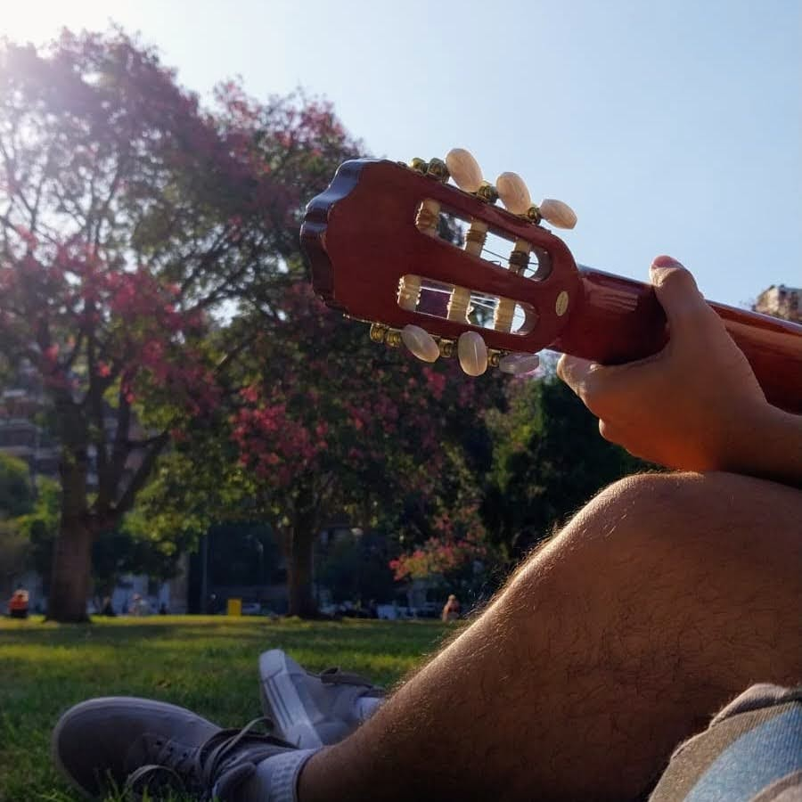

# Hola! me llamo Geronimo Becker

### Sobre mi

- Tengo 20 años
- Soy de **San Nicolas de Los Arroyos**
- Estudie en un secundario tecnico orientado a informatica
- Vivo 24/7 escuchando musica

### Hobbies

- Tocar la guitarra
- Bailar tango
- Ir al gimnasio
- Programar
- Probar cosas nuevas

#### Musica que recomiendo

1. [<kbd>Salir De La Melancolía - Serú Girán </kbd>][Link0]

2. [<kbd> After The Storm - Kali Uchis & Tyler, The Creator </kbd>][Link2]

3. [<kbd> Algo en Vos - Peces Raros   </kbd>][Link1]

4. [<kbd> how deep? - Tai Verdes </kbd>][Link3]

<!---------------------------------------------------------------------------->
[Link0]: https://open.spotify.com/track/4T9Elo8e4WcZzWm6PF3WgW?si=187b45cab9884495
[Link1]: https://open.spotify.com/track/3s0GA6XpsoY3L72GihKDlw?si=b24aee35d42b429d
[Link2]: https://open.spotify.com/track/1otG6j1WHNvl9WgXLWkHTo?si=8e0cd2d47fe5483d
[Link3]: https://open.spotify.com/track/0VcWp30A3hSJrPjdDEHeNE?si=59f33f40f17d4b53
